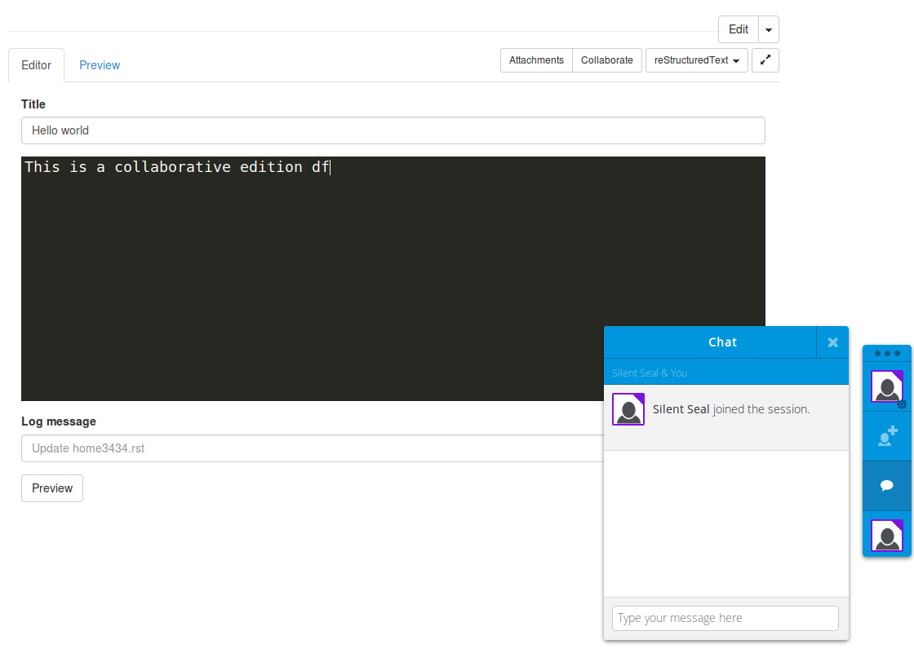

Real-time collaboration via together.js
======================================

The TogetherJS plugin enables real-time collaborative editing of a page. It builds off of Mozilla's `TogetherJS <http://togetherjs.com/>`_ library.

To install it add ``'waliki.togetherjs'`` after ``'waliki'`` in your ``settings.INSTALLED_APPS``.

   A collaborative session of two users editing a page

The only two things this plugins does is to setup ``together.js`` and add a button in the toolbar to initialize a collaborative session.

The default configuration turn off some togetherJS's features like the audio chat. It's defined in ``waliki/togetherjs_edit_extra_script.html`` and you can override it in your project to extend or replace some config variables.

Currently, it is:

.. literalinclude:: ../waliki/togetherjs/templates/waliki/togetherjs_edit_extra_script.html

